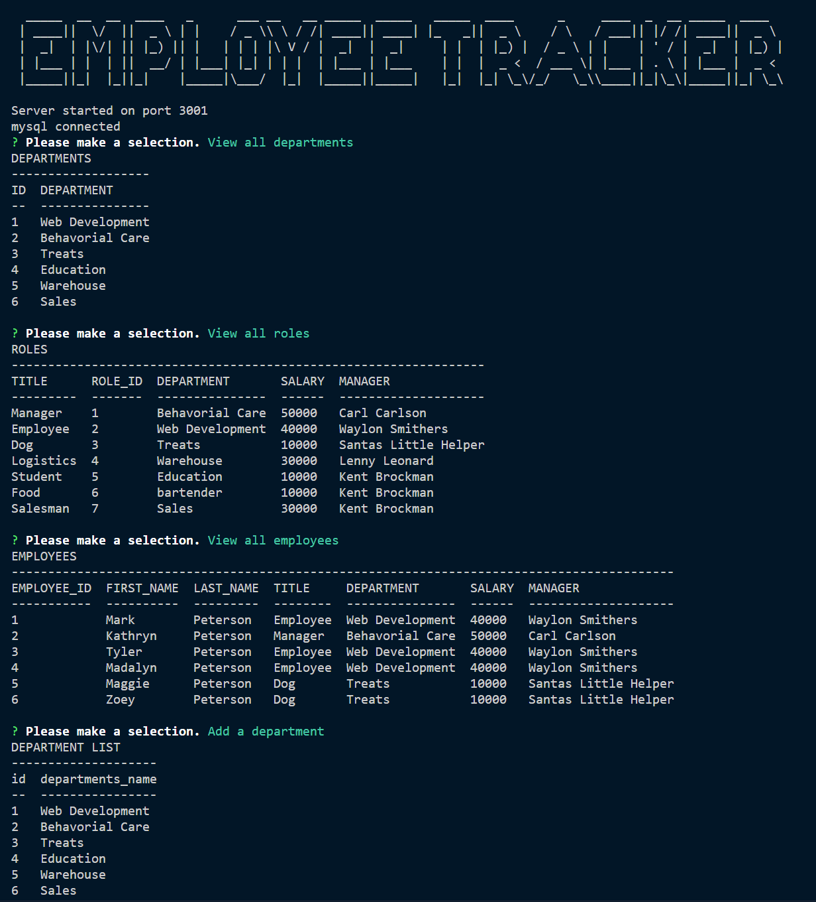

# **Employee-Tracker**   
## **In this weekly challenged, we were tasked with creating a command line employee database utilizing Node.js, Express.js, and MySQL.  This application will allow users to view, add, edit and remove employees, departments and roles within the organization.**

## **Table of Contents**

* [Deployed Application](#deployed-application)

* [Screenshot](#screenshot)

* [Installation](#installation)

* [Features](#features)

* [Usage](#usage)

* [License](#license)

* [Badges](#badges)

* [Technology](#technology)

* [Contact](#contact-information)

## **Deployed Application**
YouTube walkthrough video
https://www.youtube.com/watch?v=3mOcMqY6LLU

GitHub deployed application
https://mwpx777.github.io/Employee-Tracker/

## **Screenshot**

## **Installation**
Please type node index.js from command line

## **Features**
This project features Node.js, Express.js and MySQL, along with Figlet NPM for creating the title logo

## **Usage**
This application can be used by any person needing an application to manage their organization's employee database

## **License**
(https://opensource.org/licenses/MIT)

## **Badges**

## **Technology**
jQuery,Node.js

## **Contact Information**
##### For questions or comments, please contact

* Github: (https://github.com/mwpx777)

* LinkedIn: (https://www.linkedin.com/in/mwpdesigns/)

* Email: (mwpx777@gmail.com)

